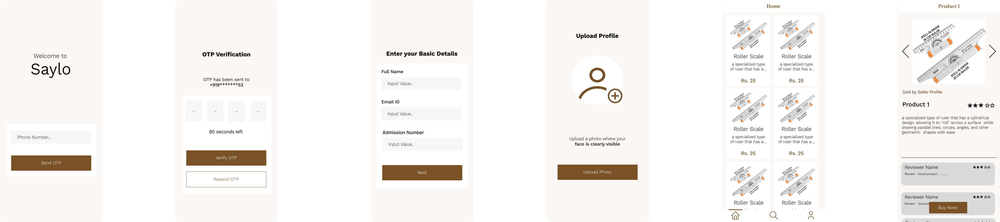

# Saylo
This project aims to create a website that helps students within a campus environment to sell items that are no longer useful to them but might be valuable to others. By streamlining the buying and selling process, the platform will foster a sustainable and efficient exchange of resources among students

## Goals
1. Promote reuse of stuffs
2. Helps students to save money

## Overall Plan
1. Create an easy-to-use platform with intuitive tagging features (e.g., hashtags like
#year1, #year2, #cse, #mech).
2. Enable user registration with fields like year, department, and additional relevant
information.
3. Implement categorization for products (e.g., stationery, textbooks, records).
4. Introduce a reputation system for sellers, including features like:
    - Price tracking
    - Buyer authentication based on Phone no./Email
    - Seller authentication using college ID or similar
5. Develop an admin dashboard for:
    - Reviewing buyer and seller feedback
    - Resolving concerns
    - Monitoring overall platform activity

## Design

    

## Roadmap

- [x] Ideation
- [x] Development Plan
- [x] Designing
- [ ] Frontend Development
- [ ] Backend Development
- [ ] Marketing
- [ ] Deployment
